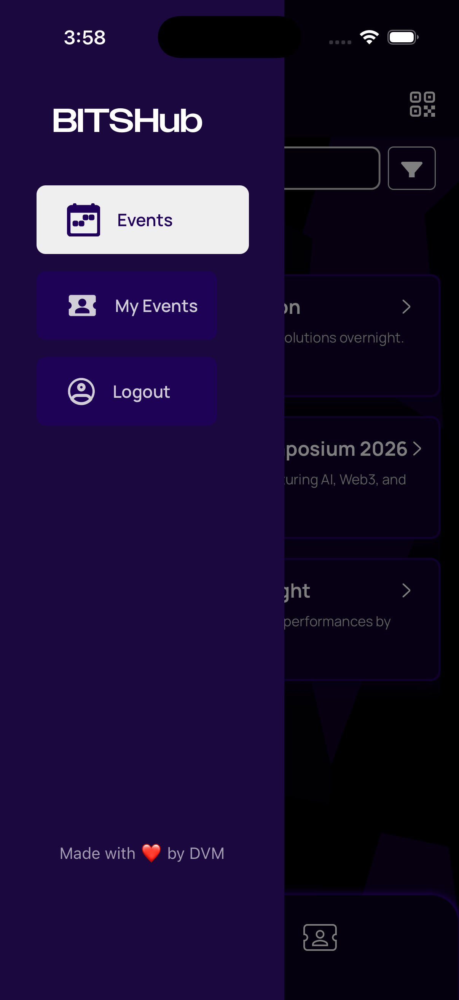
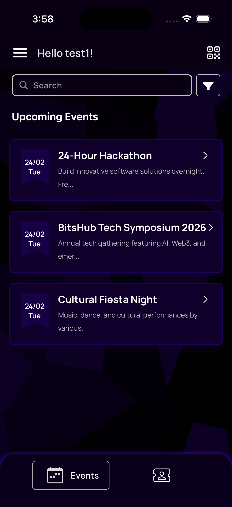
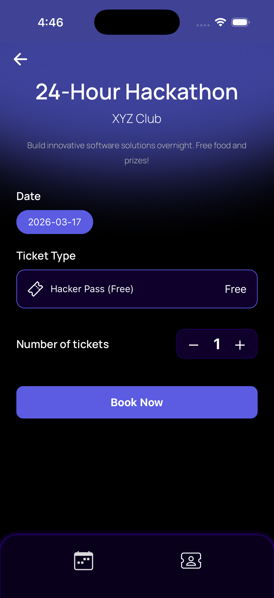
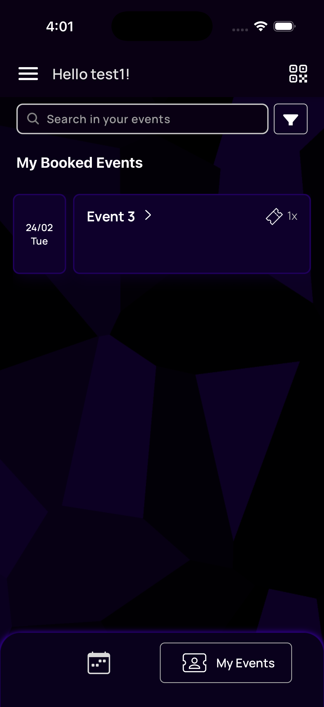
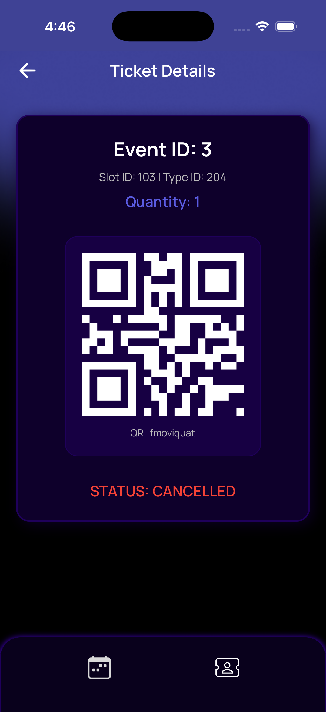
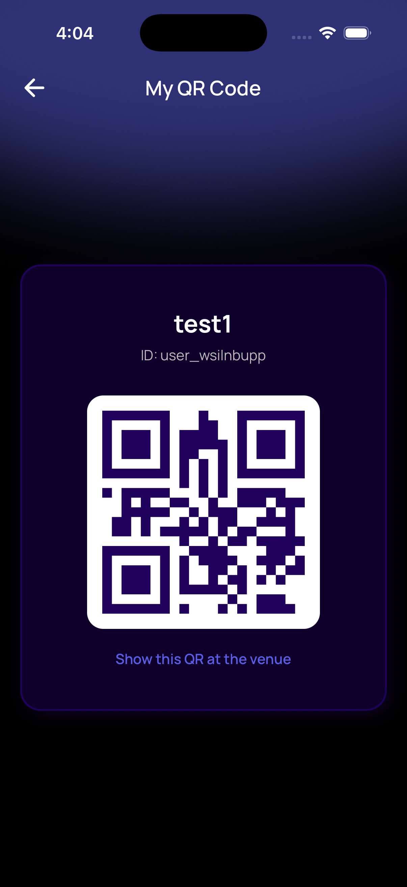
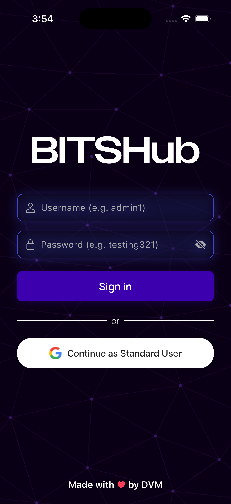
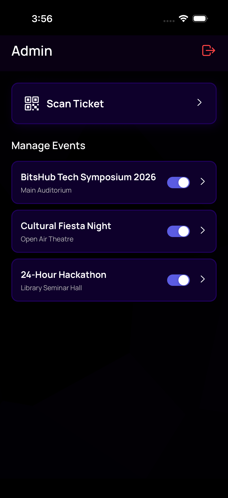
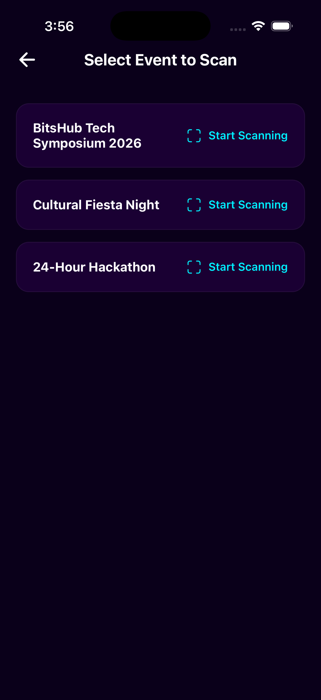
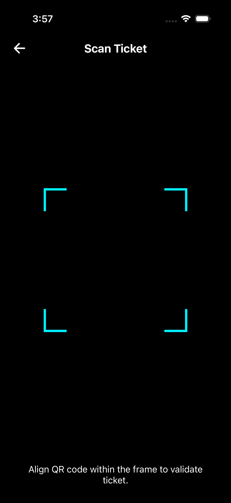

# BitsHub (Expo React Native)

BitsHub is a mobile app for browsing events, booking/managing tickets, and showing QR-based event passes.

## Tech Stack

- Expo + React Native + TypeScript
- Expo Router (file-based routing)
- Zustand (secure + fast local state)
- React Navigation (Tabs + Drawer)
- Drizzle ORM + Expo SQLite
- Axios + Mock API adapter for local/demo auth and data

## Main Features

- Login flow (admin + standard user via mock auth)
- Drawer + tab navigation
- Events listing + event details
- My Events + My Event Details
- QR screen for ticket/user identity
- Admin routes (event management + QR scan flows)

## Project Structure (high level)

- `src/app` - App routes/screens (login, private tabs, admin)
- `src/components` - Reusable UI components
- `src/state` - Zustand stores (secure/fast/base)
- `src/api` - API clients + mock adapter/data
- `src/models` - Drizzle/SQLite schema + DB client
- `assets` - Icons, images, fonts, and rive assets

## Prerequisites

- Node.js 20+ (recommended LTS)
- Bun
- Xcode (for iOS builds on macOS)
- Android Studio + Android SDK (for Android builds)

## Install

```bash
bun install
```

## Run (Development)

Start Expo dev server:

```bash
bun run start
```

Run directly on simulator/device:

```bash
bun run ios
bun run android
```

## Build Notes

This project includes `eas.json`, so cloud builds can be done with EAS.

Use EAS CLI via Bun (no global install needed):

```bash
bunx eas-cli --version
```

Login and build:

```bash
bunx eas-cli login
bunx eas-cli build --platform ios
bunx eas-cli build --platform android
```

## Lint

```bash
bun run lint
```

## Demo Login

- Admin (mock):
  - Username: `admin1`
  - Password: `testing321`
- Standard user: use any other credentials or the `Continue as Standard User` button.

## Screenshots

Use the `screenshots` folder in the project root with these files:

1. `01-drawer.png`
2. `02-events.png`
3. `03-event-details.png`
4. `04-my-events.png`
5. `05-my-event-details.png`
6. `06-qr.png`
7. `07-login.png`
8. `08-admin-home.png`
9. `09-admin-event.png`
10. `10-admin-scan.png`

This section renders all screenshots on GitHub:

### App Screens

| Drawer                               | Events                               | Event Details                                      |
| ------------------------------------ | ------------------------------------ | -------------------------------------------------- |
|  |  |  |

| My Events                                  | My Event Details                                         | QR                           |
| ------------------------------------------ | -------------------------------------------------------- | ---------------------------- |
|  |  |  |

| Login                              | Admin Home                                   | Admin Event                                    |
| ---------------------------------- | -------------------------------------------- | ---------------------------------------------- |
|  |  |  |

<p align="center">
  
</p>

## Useful Commands

- `bun run db:generate` - Generate Drizzle migrations
- `bun run db:studio` - Open Drizzle Studio

## Notes

- Native folders may be generated/managed by Expo workflows depending on your setup.
- Push notifications/deep-link behavior depends on environment configuration and platform setup.
