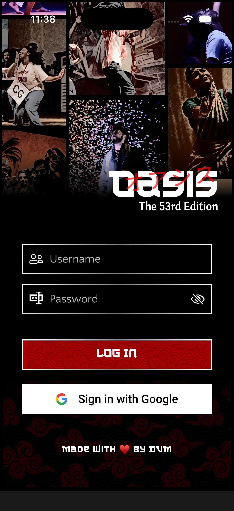
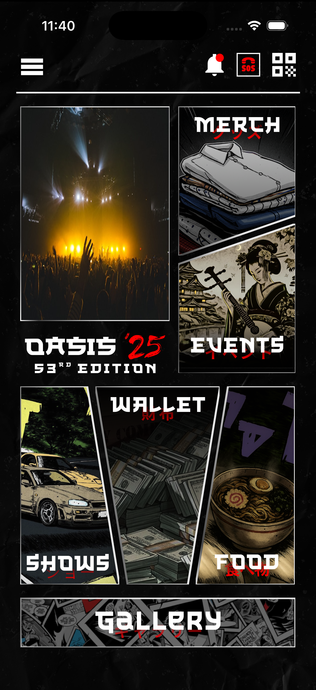
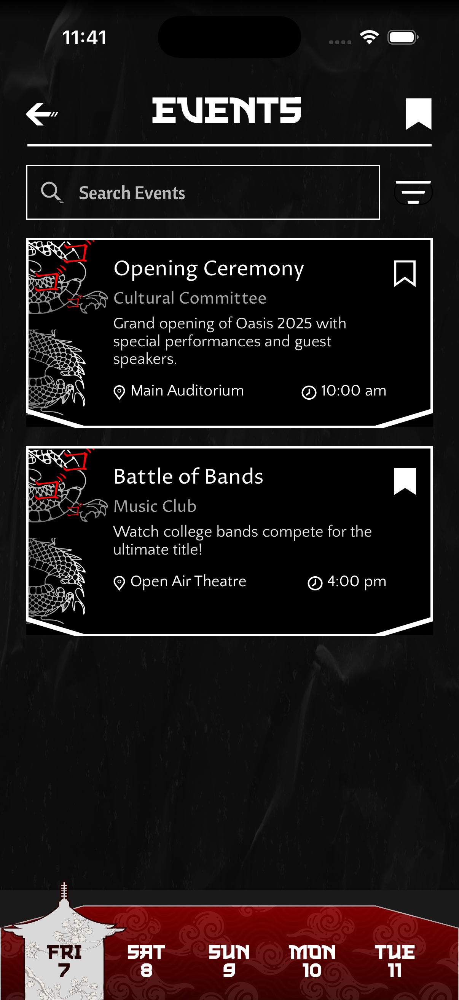
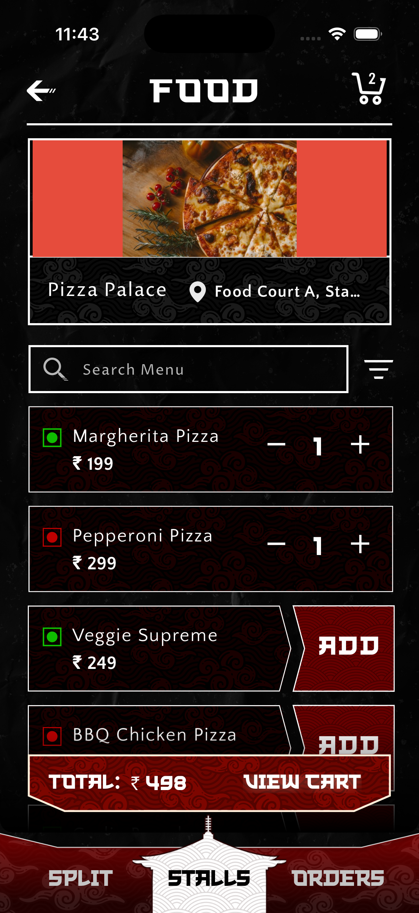
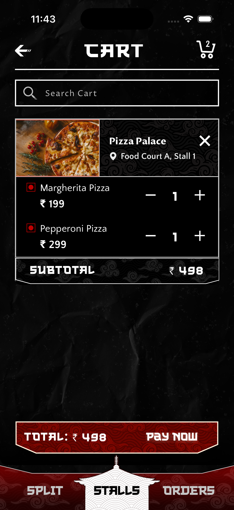
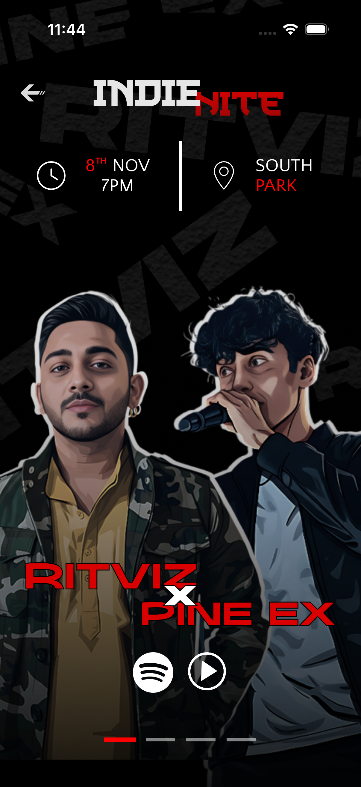
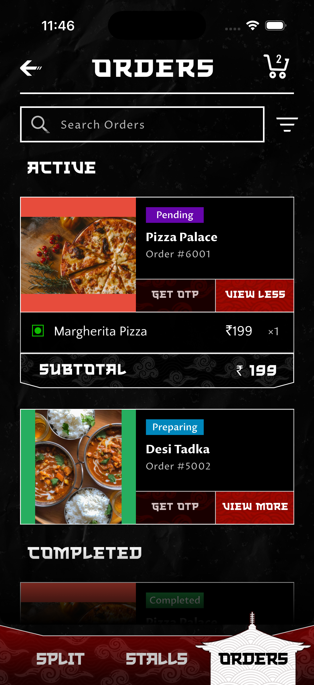
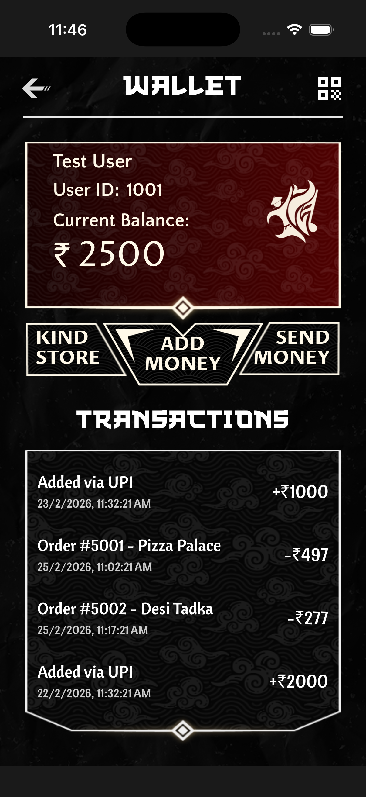
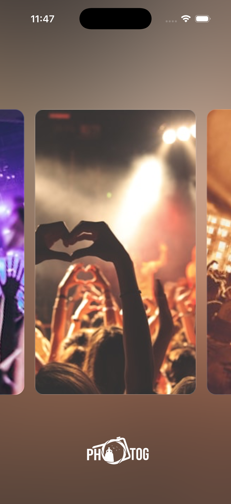
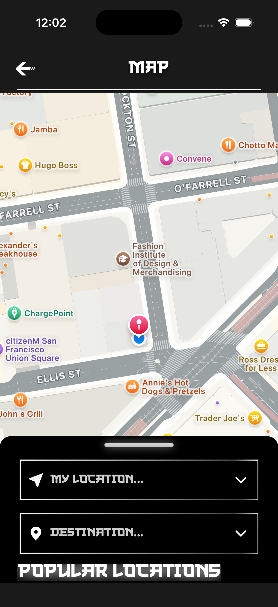

# Oasis 2026 App (Expo React Native)

Oasis is a mobile app for browsing events, ordering food at stalls, splitting bills, managing wallets, and showing QR-based checking.

## Tech Stack

- Expo + React Native + TypeScript
- Expo Router (file-based routing)
- Zustand (secure + fast local state & MMKV)
- React Navigation (Tabs + Drawer)
- Drizzle ORM + Expo SQLite
- Axios + Mock API adapter for local/demo auth and data

## Main Features

- Login flow (standard user via biometric auth/guest)
- Drawer + tab navigation
- Events listing + event sorting categorizations
- Food ordering + shopping cart persistence
- Offline Wallet management & Mock transfer system
- QR screen for secure token scanning identity

## Project Structure (high level)

- `src/app` - App routes/screens (login, private tabs, misc)
- `src/components` - Reusable UI components
- `src/state` - Zustand stores (secure/fast/base)
- `src/api` - Mock API clients + dummy adapter/data
- `src/models` - Drizzle/SQLite schema + DB wipe protocols
- `assets` - Icons, images, fonts, and rive assets

## Prerequisites

- Node.js 20+ (recommended LTS)
- Bun
- Xcode (for iOS builds on macOS)
- Android Studio + Android SDK (for Android builds)

## Fresh Setup

Clone and enter project:

```bash
git clone <your-repo-url>
cd OasisApp
```

Install dependencies:

```bash
bun install
```

If `ios/` or `android/` folders are not present, generate them:

```bash
bunx expo prebuild
```

## Run (Development)

Start Expo dev server:

```bash
bun run start
```

Run directly on simulator/device:

```bash
bun run ios
bun run android
```

## Build

### Local Native Build

```bash
bun run ios
bun run android
```

### EAS Cloud Build

This project includes `app.json`, so cloud builds can be done locally or utilizing EAS.

Use EAS CLI via Bun (no global install needed):

```bash
bunx eas-cli --version
```

Login and run build profiles:

```bash
bunx eas-cli login
bunx eas-cli build --profile preview --platform ios
bunx eas-cli build --profile apk-release --platform android
```

For store-ready builds:

```bash
bunx eas-cli build --profile production --platform all
```

## Lint

```bash
bun run lint
```

## Screenshots

The requested screenshots are available in the project under a localized source.

This section renders all screenshots on GitHub:

### App Screens

| Login                              | Home                             | Events                               |
| ---------------------------------- | -------------------------------- | ------------------------------------ |
|  |  |  |

| Food                             | Menu                                | Cart                                       |
| -------------------------------- | ----------------------------------- | ------------------------------------------ |
|  |  |  |

| QR                           | Shows                              | Orders                                    |
| ---------------------------- | ---------------------------------- | ----------------------------------------- |
|  |  |  |

| Wallet                                       | Gallery                                | Maps                             |
| -------------------------------------------- | -------------------------------------- | -------------------------------- |
|  |  |  |

## Useful Commands

- `bun run db:generate` - Generate Drizzle migrations
- `bun run db:studio` - Open Drizzle Studio

## Notes

- All data workflows are dynamically mocked using native storage hooks mimicking standard database API.
- Push notifications/deep-link behavior depends on environment configuration and platform setup.
